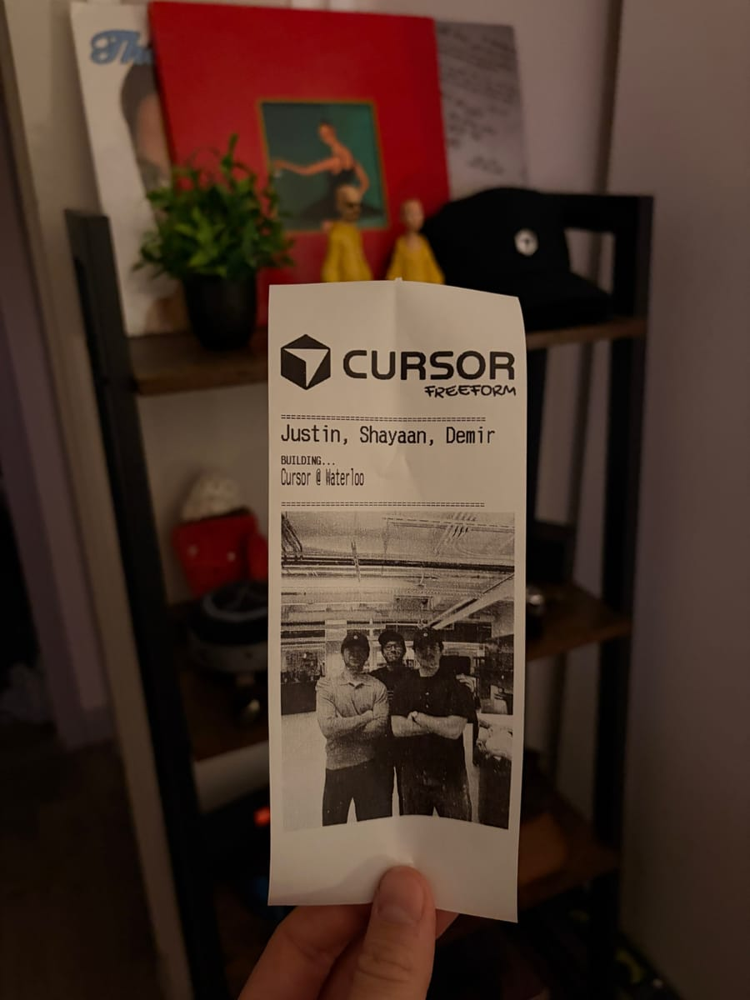
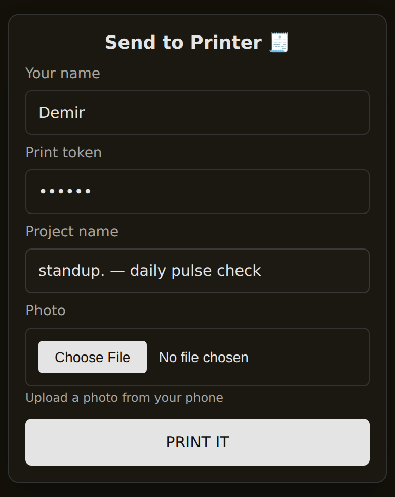

# cursor-receipts 🧾

When you build software there's nothing to hold at the end, just a URL and a screenshot. cursor-receipts gives builder events a physical keepsake. People open a page on their phone, type what they're building and add a photo, and a thermal printer on the table prints it as a receipt a few seconds later. Everyone walks out holding what they made.

I built it for the Cursor community events I ran as campus lead in Waterloo and Toronto, from Cafe Cursor pop-ups to Freeform build nights. It was inspired by the print station Ameen Neami set up at Toronto's first Cafe Cursor.

<table>
  <tr>
    <td width="50%"></td>
    <td width="50%"></td>
  </tr>
  <tr>
    <td align="center"><sub>The first version, at Cafe Cursor</sub></td>
    <td align="center"><sub>The current layout, with the Freeform logo</sub></td>
  </tr>
</table>

## How it works

<p align="center">
  
</p>

```
phone ──► web form ──► Bun server (laptop) ──► print queue ──► lp -o raw ──► USB thermal printer
              ▲                                (1 job / 8s)
     Cloudflare Tunnel
```

1. The Bun server serves a mobile-friendly form and accepts uploads on `POST /chat`.
2. Jobs go into a queue that prints one receipt every 8 seconds, so a rush of uploads doesn't jam the printer.
3. Each photo is auto-rotated from EXIF (so iPhone photos aren't sideways), scaled to the printer's 576-dot width with `sharp`, then Floyd–Steinberg dithered down to 1-bit so photos keep their shading.
4. The server builds the receipt as raw ESC/POS bytes (logo, name, `BUILDING...` plus the project name, the photo, then an auto-cut) and sends it to the printer through CUPS.

**Stack:** Bun, TypeScript, sharp, pngjs, ESC/POS, CUPS, Cloudflare Tunnel

## Setup

Requires [Bun](https://bun.sh) and macOS or Linux with CUPS.

1. **Add the printer to CUPS.** Plug in the USB printer and add it (macOS: System Settings → Printers & Scanners). Find its name with:
   ```bash
   lpstat -p
   ```
2. **Install dependencies:**
   ```bash
   bun install
   ```
3. **Run the server:**
   ```bash
   PRINTER_NAME=EPSON_TM_T20II bun start
   ```
   A test receipt prints on startup.
4. **Open it** at `http://YOUR-LOCAL-IP:9999` from any device on the same network (macOS: `ipconfig getifaddr en0`).

### Configuration

| Variable          | Default          | Description                                                 |
| ----------------- | ---------------- | ----------------------------------------------------------- |
| `PRINTER_NAME`    | `EPSON_TM_T20II` | CUPS printer name (from `lpstat -p`)                        |
| `PORT`            | `9999`           | Port for the web server                                     |
| `PRINT_TOKEN`     | none             | Shared secret required to print. Set this for public access |
| `PUBLIC_BASE_URL` | none             | Public URL, printed in the server logs                      |

The receipt header uses `assets/cursor_freeform.png`, falling back to `assets/logo.png`. Swap either file to rebrand it for your own event.

## Running it at an event

The printer is plugged into a laptop, so the laptop has to stay on and run the server. To let people print from their phones on any network (event Wi-Fi is often isolated), expose the server with a tunnel and turn on the token:

```bash
PRINT_TOKEN=choose-a-long-secret bun start
cloudflared tunnel --url http://localhost:9999   # brew install cloudflared
```

Share the generated `https://...trycloudflare.com` URL (a QR code on the table works well) and the token. [ngrok](https://ngrok.com) also works: `ngrok http 9999`.

## Endpoints

| Route          | Description                                                                          |
| -------------- | ------------------------------------------------------------------------------------ |
| `GET /`        | Upload form                                                                          |
| `POST /chat`   | Multipart form: `name`, `text`, `image`, `token` (or an `x-print-token` header)      |
| `GET /health`  | `{ ok, queueLength, printer }`                                                       |

Uploads are capped at 25 MB.

## Supported printers

Any 80mm ESC/POS thermal printer that supports raster images (`GS v 0`), including:

- Epson TM-T20II, TM-m30 series, TM-m50
- Star Micronics printers in ESC/POS mode
